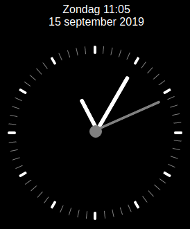

# lovelace-clock
clock card for my lovelace dashboard

view live demo here:
https://marcwagner.github.io/clock/lovelace_clock.html

add the following in your ui-lovelace.yaml

    cards:
     - type: iframe
       url: https://marcwagner.github.io/clock/lovelace_clock.html
       aspect_ratio: 110% # tweak this to get it to fit right
